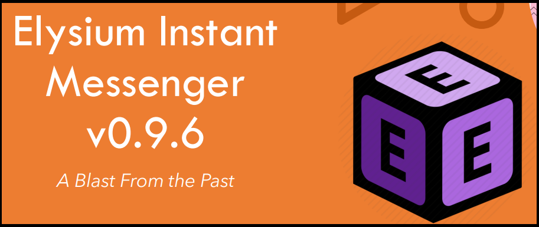
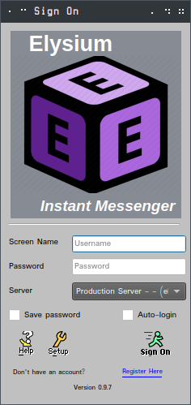
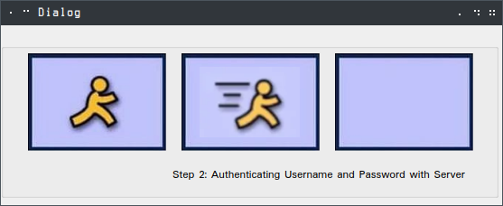
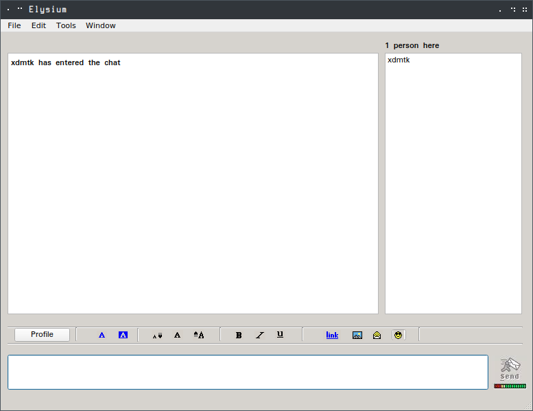

# Elysium Instant Messenger



### Introduction

Elysium Instant Messenger is a free, client/server chat application with the retro look of the now  defunct AOL 
Instant Messenger.  The Client application was written in C++ using the  Open-Source version of the Qt Framework, 
while the Server  application was written in C++ using only the standard library. 

Our username/password database runs off an AWS EC2  server running a local MySQL instance, with a corresponding API 
written in PHP that registers users off our website, and sends an email confirmation link to verify the account.

### Current Status

Elysium Instant Messenger (EIM) was built originally as a school project. As a result of this, the dedicated server hosting
the server portion of EIM no longer exists. 

However, for all those that are interested, the code is well documented and very easy to configure to run on your own
dedicated server. This means with some simple modifications, you can relive the late 90's and early 2000's nostalgia.

### Building

The client application is written entirely in Qt 5.12. A full installation of Qt, along with the Qtcreator is required, 
however once this is complete, load up the `Elysium.pro` file and the rest is plug and play. 

The server application is written entirely in the standard library. To build
```
$ cd src/server
$ cmake .
$ make
```

This outputs an executable `elysium-server`. Run this on your own dedicated server and the client will be able to
seamlessly connect (given the host/port information is reset in the Client). 

### Features

* Fully functional username/password combo authentication (Only valid in School server)
* Username registration with email verification link (Only valid in School server)
* User and chat lobby mentions
* Old school AOL Instant Messenger UI look and feel
* Typing indicator
* Dark mode
* Configurable message sounds

### Screenshots



_Main Login Window_



_Sign-on Window_



_Main Chat Window_


### Authors

* Nick Martinez - [@xdmtk](https://github.com/xdmtk)
* Sebastian Enciso - [@Sebastianbabble](https://github.com/sebastianbabble)
* Josh Foster - [@FFChicken](https://github.com/FFChicken)
* Erick Vicencio - [@demiurge94](https://github.com/demiurge94)
* Daniel Rivera - [@riveradaniel236](https://github.com/riveradaniel236)


 
